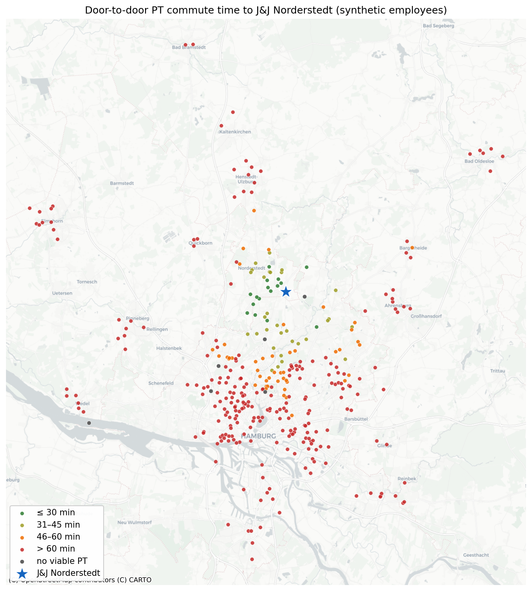

# Deutschlandticket Commute Potential

A data science case study estimating how attractive public transport is for employees
commuting to **Robert-Koch-Straße 1, 22851 Norderstedt**, and their likely
**Deutschlandticket** adoption built entirely on **synthetic employee data**.

## Highlights

- **Real routing, synthetic people.** 350 synthetic employees are sampled across 52 Hamburg
  districts and surrounding towns, weighted by real population figures. Each one gets a
  genuine door-to-door HVV itinerary (walk → bus/U-Bahn/S-Bahn/rail → walk) for a Monday
  08:00 arrival, computed via the open [Transitous](https://transitous.org) API on official
  HVV/DELFI GTFS timetables — resolving down to the *Glashütte, Robert-Koch-Straße* bus stop
  at the plant gate.
- **Transparent adoption model.** A rule-based 0–100 score built on established mode-choice
  drivers (time vs. car, transfers, walking, cost savings) fully interpretable, tunable in
  one place, and honest about being a proxy rather than a trained behavioral model.
- **Actionable output.** Commute-time bands, adoption classes, strongest/weakest catchment
  areas, key adoption drivers, and an interactive Folium map with toggleable layers.
## Interactive map



*Static preview — open the full interactive version:
[**View live map**](https://htmlpreview.github.io/?https://github.com/wombus23/deutschlandticket-commute-analysis/blob/main/outputs/commute_map.html)
or download [`outputs/commute_map.html`](outputs/commute_map.html) and open it in a browser.*
## Repository structure

```
├── deutschlandticket_commute_analysis.ipynb   # main deliverable (executed, with outputs)
├── src/commute_pipeline.py                    # reusable pipeline: sampling, routing, scoring
├── data/
│   ├── synthetic_employees.csv                # generated synthetic employees
│   └── commute_results.csv                    # cached routing + scoring results
├── outputs/commute_map.html                   # standalone interactive map
└── requirements.txt
```

## How to run

```bash
pip install -r requirements.txt
jupyter notebook deutschlandticket_commute_analysis.ipynb
```

By default the notebook runs **offline in seconds** from the cached results in `data/`.
Set `LIVE_FETCH = True` in the first code cell to re-query all 350 itineraries from the
routing API (~4 minutes, polite bounded concurrency).

## Headline findings (synthetic sample, n = 350)

- **4.7%** of employees reach the site within 30 min by PT, **8.7%** in 31–45 min,
  **13.4%** in 46–60 min, and **73.3%** need over an hour (1.7% have no viable connection).
- Median journey: **~72 min with 2–3 transfers** — the bus-only last mile into the Glashütte
  industrial area is the bottleneck.
- Adoption potential concentrates along the **U1 corridor**: Norderstedt, Langenhorn,
  Fuhlsbüttel/Ohlsdorf and the Alstertal districts.
- The €58 ticket beats car running costs for nearly everyone — cost is not the barrier,
  **time and transfers are**. The highest-leverage intervention is a last-mile shuttle from
  U1 Norderstedt Mitte / Langenhorn Markt.

## Data & privacy

No real employee data is used anywhere. Home locations are randomly generated from public
population statistics; the pipeline is designed so anonymized real inputs could be swapped
in later without code changes.
